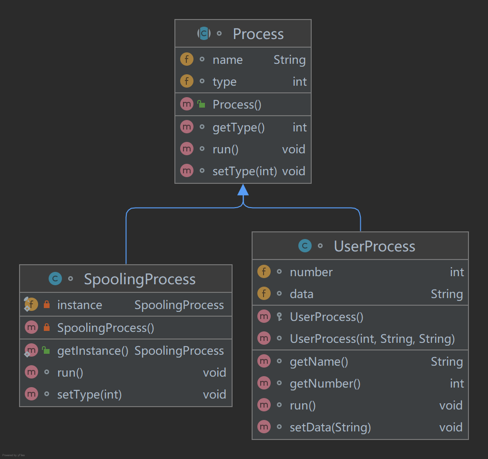
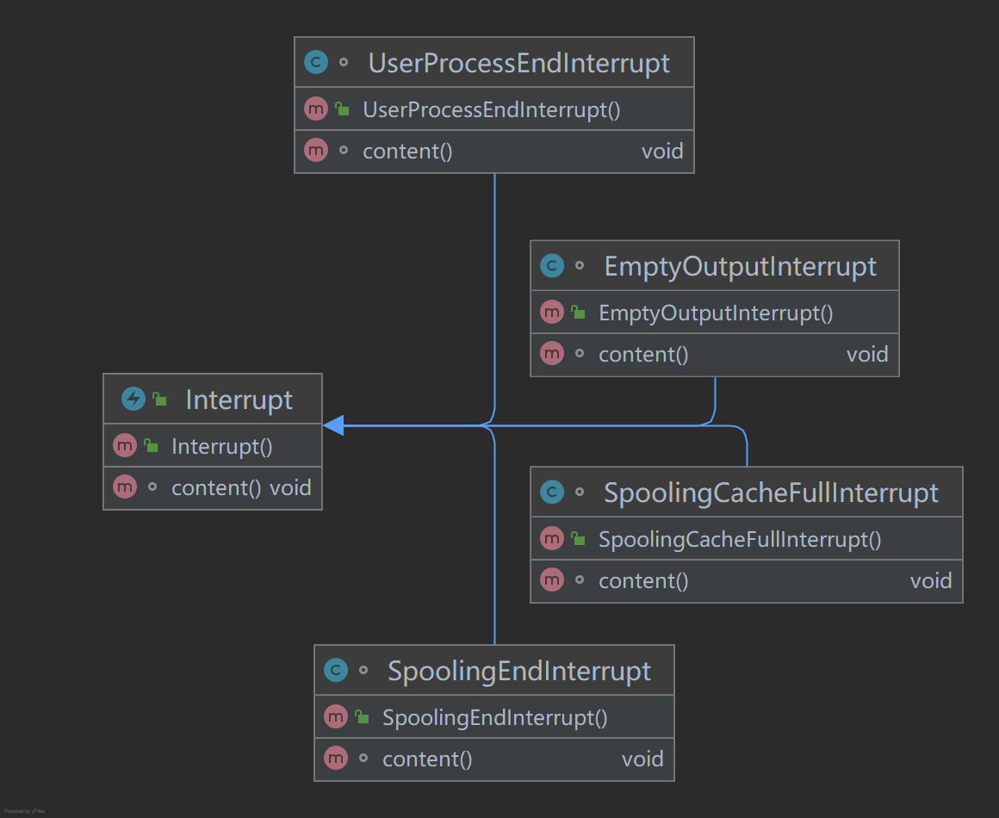
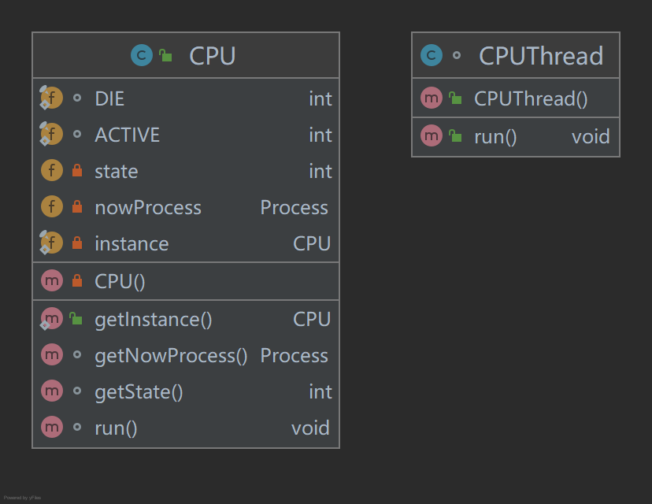
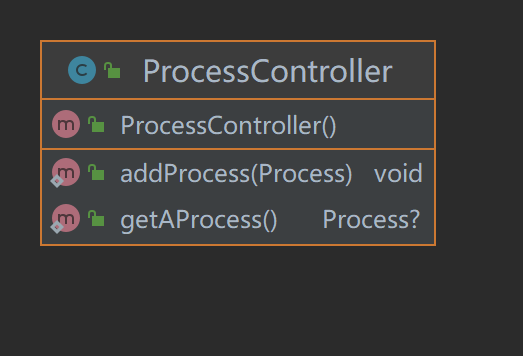
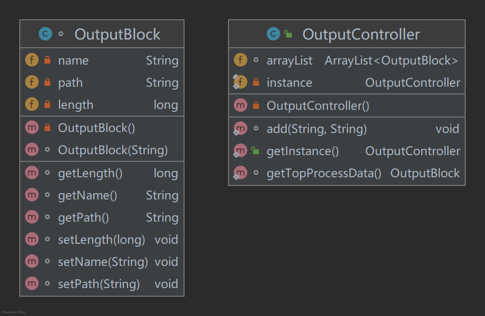
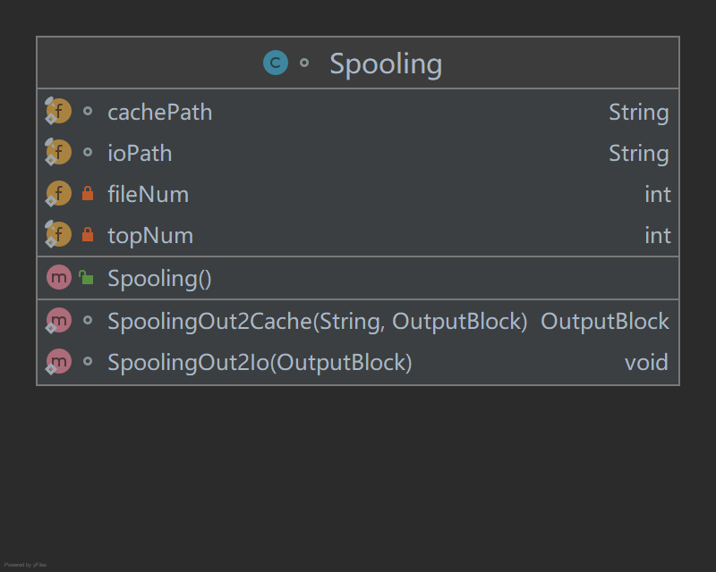
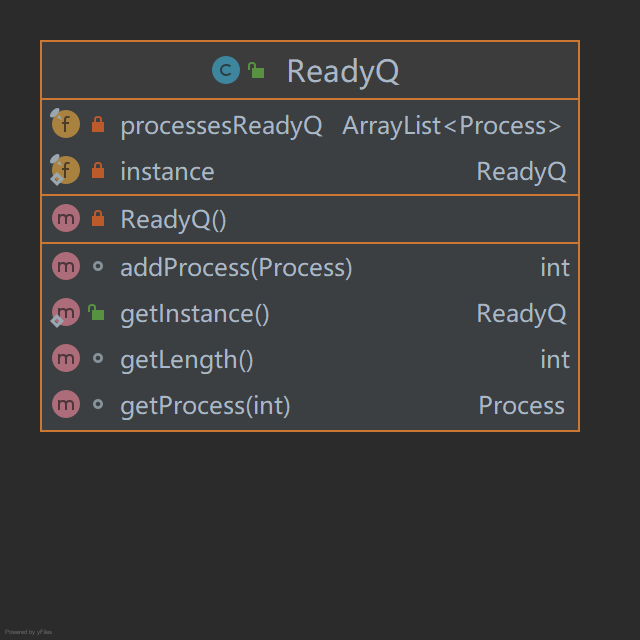
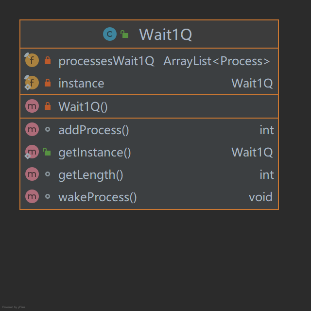

# 本次操作系统的课程设计--SPOOLING假脱机输入输出技术模拟

## 题目

1. 设计一个实现SP001ING技术的进程
要求设计一个SPOOLING输出进程和两个请求输出的用户进程，以及一个SPOOLING输出服务程序。当请求输出的用户进程希望输出一系列信息时，调用输出服务程序，由输出服务程序将该信息送入输出井。待遇到一个输出结束标志时，表示进程该次的输出文件输出结束。之后，申请一个输出请求块(用来记录请求输出的用户进程的名字、信息在输出井中的位置、要输出信息的长度等)，等待SP00LING进程进行输出。
SP00LING输出进程工作时，根据请求块记录的各进程要输出的信息，将其实际输出到打印机或显示器。这里，SP00LING输出进程与请求输出的用户进程可并发运行。
2. 设计进程调度算法
进程调度采用随机算法，这与进程输出信息的随机性相一致。两个请求输出的用户进程的调度概率各为45％，SP00LING输出进程为10％，这由随机数发生器产生的随机数来模拟决定。
3. 进程状态
进程基本状态有3种，分别为可执行、等待和结束。可执行态就是进程正在运行或等待调度的状态；等待状态又分为等待状态1、等待状态2和等待状态3。
状态变化的条件为：
   1. 进程执行完成时，置为“结束”态。
   2. 服务程序在将输出信息送输出井时，如发现输出井已满，将调用进程置为“等待状态1”。
   3. SP00LING进程在进行输出时，若输出井空，则进入“等待状态2”。
   4. SP00LING进程输出一个信息块后，应立即释放该信息块所占的输出井空间，并将正在等待输出的进程置为“可执行状态”。
   5. 服务程序在输出信息到输出井并形成输出请求信息块后，若SP00LING进程处于等待态，则将其置为“可执行状态”。
   6. 当用户进程申请请求输出块时，若没有可用请求块时，调用进程进人“等待状态3”

## 概要设计

当然，整软件应该分为两个部分, 逻辑代码区 和 图形界面 区, 

### 图形界面

图形界面比较容易设计，只需要让其监视 逻辑代码 区域中的各种变量(数据劫持), 并实时呈现出来即可

### 逻辑代码

我将该设计的题目理解为, 使用软件去仿真一系列的硬件及软件, 具体仿真的对象为

* 一个 `CPU`  
   这个 `CPU` 的作用为, 运行 用户进程 `userProcess` 以及 Spooling 进程 `spoolingProcess` , 并且处理各种异常情况 `Interrupt`   
* 一个 就绪队列 `readyQ` , 一个等待队列 `wait1Q`  
   这两个队列中存放各个尚未进入 `CPU` 的 `userProcess`  
* 一个进程调度机关 `ProcessController` 
   这个机关负责在 `readyQ` 中取出 `userProcess` 投入至 `CPU` 中, 负责 与外界交互, 即将进程添加到 `readyQ` 队列中  
* 一组 用户进程 `userProcess` 和 一个 Spooling 进程 `spoolingProcess`  
   这些充当 ***软件*** 的作用, `userProcess` 调用 输出相关代码 `spooling.spoolingOut2Cache` 将自身的数据文件输出至缓冲区中 
   `spoolingProcess` 调用 输出相关代码 `spooling.SpoolingOut2Io` 将缓冲区文件输出至 io 设备中 
  更具体的来说, `spoolingProcess` 和 `userProcess`本质上都是 (继承自) `process` , 只是两者的代码区不同而已  
* 输出相关代码 `spooling` 
   类似于操作系统中 驱动 的身份, 担任 `process` 与 缓冲区 和 输出设备 交互中介

## 具体逻辑代码设计

### `Process`

进程分为两类, 一类是用户自定义的进程 `userProcess` 一类是 `spoolingProcess` 二者的关系如下

每个 process 实例使用 `name` 属性 进行区分. 
`run()` 方法为 process 的代码区域, 当 `CPU` 拿到 process 之后, 会直接运行 `run()` 方法

### process 相关 -- `interrupt`

`interrupt` 为中断区域, 在 process 执行期间, 遇到的各种异常情况(如 输出缓冲区满, 程序运行结束 等情况) 需要发出中断, 指导 `CPU` 去处理相关异常情况. 
本程序引入了四种中断  

四种中断分别为: 
* 输出缓冲区空  
   此中断由 `spoolingProcess` 发出, 会将 `spoolingProcess` 的状态由 就绪态 转化为 wait_2 态  
* 输出缓冲区满 
   此中断由 输出相关代码(驱动) 发出, 会将当前 CPU 中执行的 userProcess 取出, 放入 wait_1 队列.  
* 进程结束 
   此中断由 `userProcess` 发出, 表示此进程已执行完毕(已经将需要输出的数据送至输出井), 更改 `spoolingProcess` 的状态为 就绪态 并指示 `CPU` 取下一进程  
* spooling程序结束  
   此中断由 `spoolingProcess` 发出, 表示 spooling 进程已经将输出井中的一个缓存文件输出完毕, 会将所有等待的进程置于 就绪态  

CPU 获取到中断后, 会自动执行中断的 `content()` 方法. 

### CPU

CPU 实际工作很简单, 向 进程调度机关`ProcessController` 索要一个 process , 运行其代码区的代码, 接收中断并进行中断处理

### 进程调度机关`ProcessController`

`ProcessController` 有两个功能

* 根据随机数的值送出一个 process
* 将某一新的 process 送入就绪队列 
   根据实际来看, 该功能可能会在同一时间被同时调用, 因此需要保证多线程安全

### 输出相关代码 `OutputController`

这个代码分为三部分 

* 输出控制器 
   该区域和两种 process 直接交互 
   userProcess将自己的唯一标识 name 以及数据 data 送入, 控制器负责将数据输出至缓冲区, 并将得到的输出控制块挂上控制块队列 
   spoolingProcess 向控制器发出信号(调用函数), 控制器在输出控制块队列上取下某一个并进行io输出  
* 输出至缓冲区部分 
   接收数据, 返回控制块  
* 输出至io部分 
   接收控制块, 开始输出  

### 两个队列 

就绪队列以及等待队列, 两者结构相似

* readyQ
   添加进程以及取出进程
* Wait1Q
   添加进程, 但不能逐个取出进程, 所有进程同时被唤醒(wake)至就绪队列

### 图形界面

不必多说

## 与题目的冲突

1. 结束态  
   实际是无效的, 本次作业中进程运行结束后直接把内存释放掉即可, 不必再修改状态  
2. spooling的wait_3 状态 
   按照我的理解来看, 用户进程在向缓冲区输出之前就需要检查长度是否允许, 不存在输出成功却无法产生输出控制块的情况    
